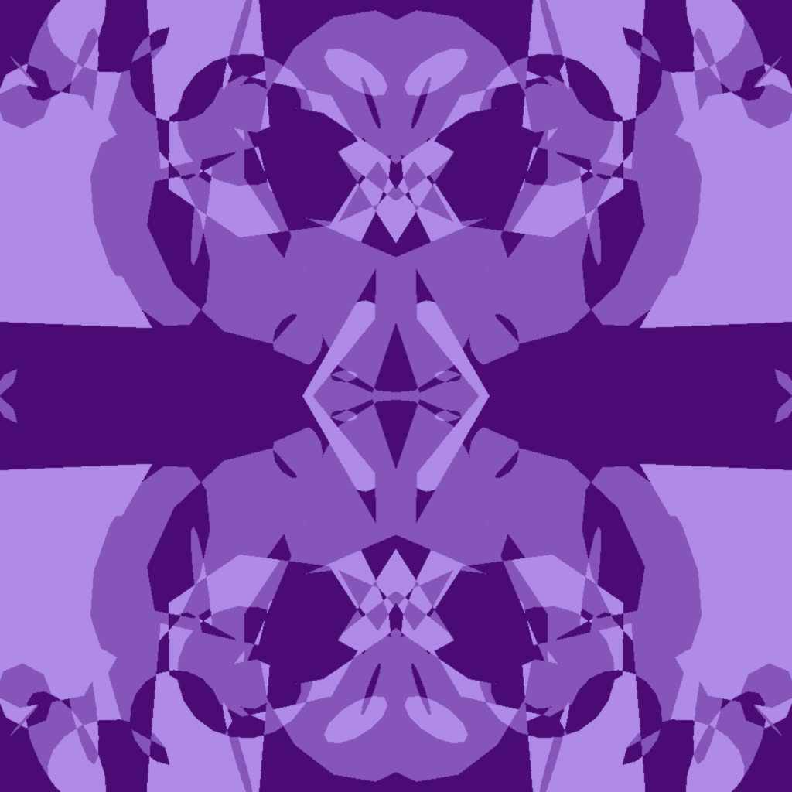
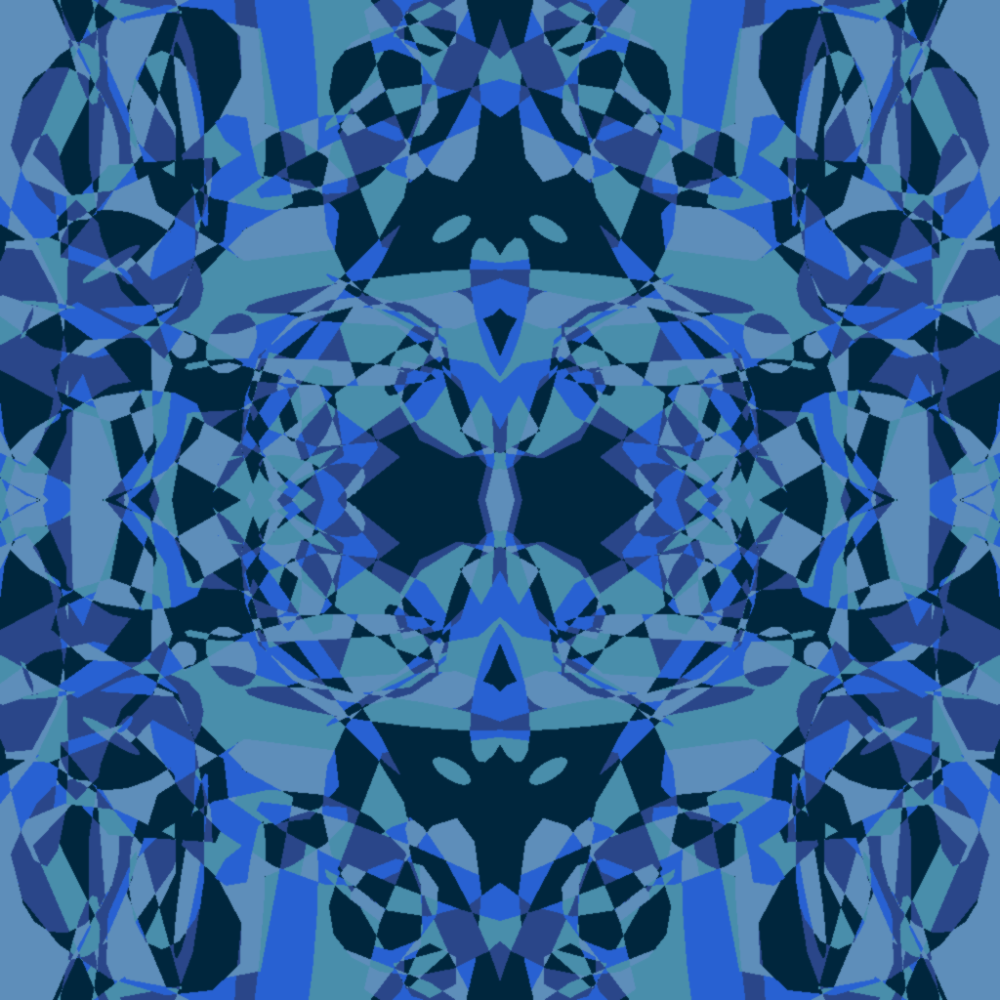

# spi-generative-art

https://fequiros.github.io/spi-generative-art/

A (very) rough, quick, and simple art generation website. It should provide
around five to ten minutes of entertainment. Here are some samples!:

  
  
  
  

